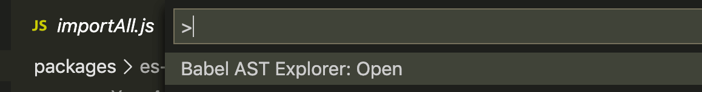
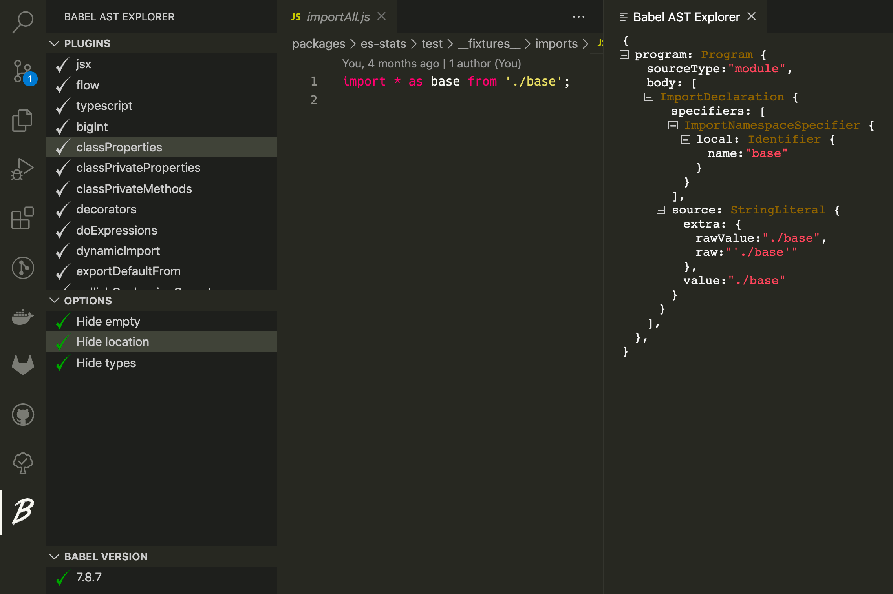
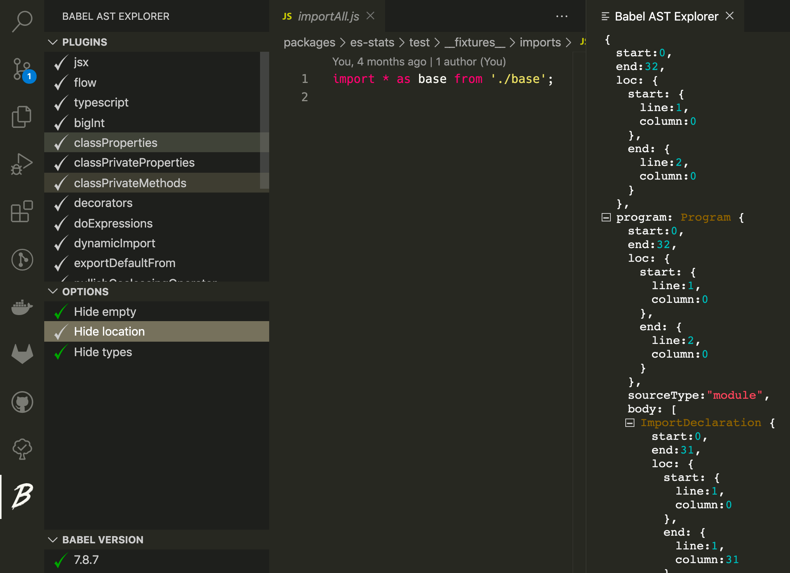

# Babel AST Explorer VSCode Extention

View AST parsed by [@babel/parser](https://babeljs.io/docs/en/babel-parser) with a simple command:

Plugins and option selections:

Currently only supports [@babel/parser](https://babeljs.io/docs/en/babel-parser)@`7.8.7`.
